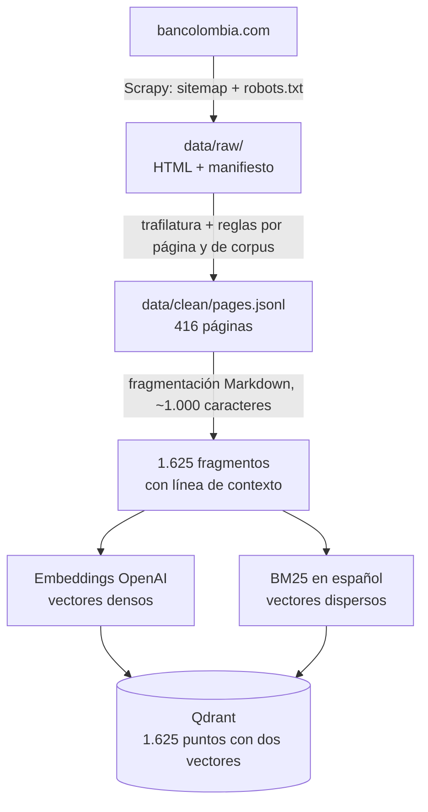
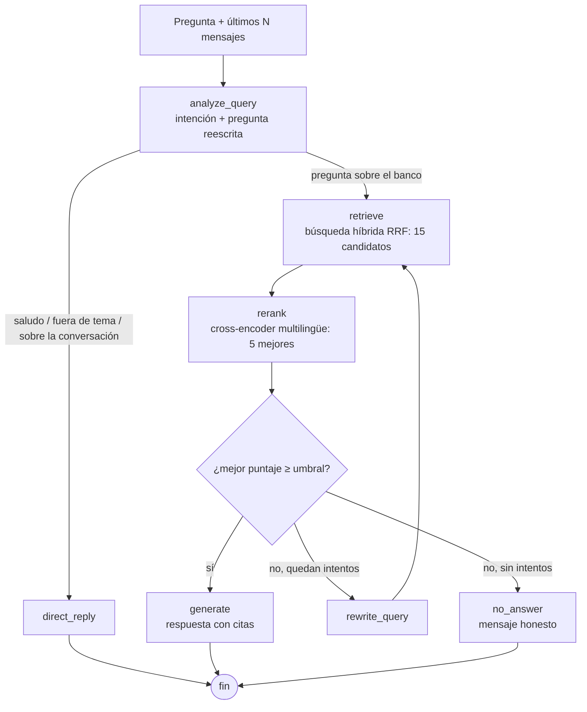

# Asistente RAG sobre el sitio de Bancolombia

Asistente conversacional que responde preguntas de usuarios internos sobre la información
publicada en el sitio web institucional de un banco colombiano, citando las páginas de donde
saca cada dato. Construido como solución a la prueba técnica *Sistema RAG con Web Scraping*.

> **Nota sobre la fuente de datos.** El enunciado propone `bbva.com.co`, pero su firewall
> bloquea el acceso automatizado (HTTP 403 incluso con User-Agent de navegador). Se decidió
> **no evadir esa protección** y, como el enunciado permite usar otro sitio, se decidio usar el sitio de
> **Bancolombia** (`bancolombia.com`) para esta prueba técnica, cuyo `robots.txt` permite el uso para RAG.
> El diagnóstico completo está en [`docs/decisions.md`](docs/decisions.md) (ADR-004).

---

## Contenido

1. [Qué hace](#qué-hace)
2. [Arquitectura](#arquitectura)
3. [Requisitos previos](#requisitos-previos)
4. [Instalación y ejecución con Docker](#instalación-y-ejecución-con-docker)
5. [Cómo usar el asistente](#cómo-usar-el-asistente)
6. [Analítica del historial](#analítica-del-historial)
7. [Patrones de diseño](#patrones-de-diseño)
8. [Stack tecnológico](#stack-tecnológico)
9. [Evaluación y resultados](#evaluación-y-resultados)
10. [Configuración](#configuración)
11. [Desarrollo local y pruebas](#desarrollo-local-y-pruebas)
12. [Estructura del proyecto](#estructura-del-proyecto)
13. [Supuestos, limitaciones y atajos](#supuestos-limitaciones-y-atajos)
14. [Mejoras futuras](#mejoras-futuras)
15. [Solución de problemas](#solución-de-problemas)

---

## Qué hace

| Requisito del enunciado | Cómo se cumple |
|---|---|
| 1. Extraer información del sitio por web scraping | Spider de **Scrapy** que recorre el sitemap oficial respetando `robots.txt` (467 páginas guardadas) |
| 2. Almacenar los datos crudos y limpios | HTML crudo + manifiesto en `data/raw/`; texto limpio en `data/clean/pages.jsonl` (416 páginas, versionado en el repositorio) |
| 3. Vectorizar e indexar en una base vectorial | 1.625 fragmentos en **Qdrant** con búsqueda híbrida (vector denso + BM25) |
| 4. Interfaz conversacional | Interfaz web en **Streamlit**, API REST con **FastAPI** y chat en terminal |
| 5. Historial por ID con N mensajes configurables | Conversaciones persistidas en **PostgreSQL**; `HISTORY_MAX_MESSAGES` define N |
| Docker con un solo comando | `docker compose up --build` levanta los 5 servicios |
| Al menos 3 patrones de diseño | 6 patrones documentados ([ver sección](#patrones-de-diseño)) |
| Análisis del histórico | Métricas de uso, calidad, latencia, vacíos de contenido, temas e impacto |
| **Bonus 1:** reranker | Cross-encoder multilingüe: hit@5 de 60 % a 93 % |
| **Bonus 2: ** manejo de errores | Reintentos, timeouts, mensajes amables, errores persistidos y chequeos de salud |

Cada respuesta cita sus fuentes. Si el contenido no está en el sitio, el asistente lo dice
en lugar de inventar.

---

## Arquitectura

### Flujo de datos (offline, una vez)



### Flujo de consulta (grafo de LangGraph)



El diagrama Mermaid generado desde el código está en [`docs/rag_graph.md`](docs/rag_graph.md).

### Servicios de Docker

| Servicio | Función | Arranca cuando |
|---|---|---|
| `qdrant` | Base vectorial | Primero |
| `postgres` | Historial de conversaciones | Primero (con chequeo de salud) |
| `ingest` | Indexa el corpus limpio **si la colección está vacía** y descarga los modelos; luego termina | Qdrant arrancó |
| `api` | FastAPI | PostgreSQL sano **y** la ingesta terminó bien |
| `ui` | Streamlit | La API está sana |

---

## Requisitos previos

- **Docker Desktop** (o Docker Engine + Docker Compose v2).
- Una **API key de OpenAI** (se usa para embeddings y para el modelo de lenguaje).
- Conexión a internet en el primer arranque: se descargan las imágenes de Docker y el
  modelo del reranker (~1,1 GB), que queda en caché en un volumen.
- Espacio en disco: varios GB (imágenes, modelo y volúmenes).

Para desarrollo local (opcional): **Python 3.12** y [**uv**](https://docs.astral.sh/uv/).

---

## Instalación y ejecución con Docker

**1. Clonar el repositorio**

```bash
git clone https://github.com/SergioANJ/bbva-rag-assistant.git
cd bbva-rag-assistant
```

**2. Crear el archivo de configuración**

```bash
cp .env.example .env          # Windows PowerShell: Copy-Item .env.example .env
```

Abrir `.env` y poner la API key:

```dotenv
OPENAI_API_KEY=sk-...
```

Es la única variable obligatoria; las demás tienen valores por defecto.

**3. Levantar el sistema**

```bash
docker compose up --build
```

El primer arranque:

1. Construye la imagen de la aplicación (unos minutos).
2. Levanta Qdrant y PostgreSQL.
3. El servicio `ingest` fragmenta e indexa el corpus limpio versionado (~30 s y menos de
   un centavo de dólar en embeddings) y descarga el reranker (~1,1 GB, solo la primera vez).
4. Levanta la API y, cuando su chequeo de salud pasa, la interfaz.

**4. Abrir**

| Qué | Dirección |
|---|---|
| Interfaz de chat y analítica | http://localhost:8501 |
| Documentación interactiva de la API | http://localhost:8001/docs |
| Estado de los servicios | http://localhost:8001/health |
| Panel de Qdrant | http://localhost:6333/dashboard |

**Comandos útiles**

```bash
docker compose ps -a          # estado (ingest debe aparecer como "Exited (0)")
docker compose logs -f api    # logs de un servicio
docker compose down           # detener, conservando datos y modelos
docker compose down -v        # detener y borrar TODO (datos, historial y modelos)
```

Los arranques siguientes son rápidos: la imagen está construida, Qdrant ya tiene datos
(la ingesta lo detecta y no reindexa) y el modelo está en caché.

---

## Cómo usar el asistente

### Interfaz web (http://localhost:8501)

- Escribir la pregunta en el chat. Cada respuesta muestra sus **fuentes** (enlaces a las
  páginas citadas).
- Calificar cada respuesta con 👍 o 👎 (alimenta la métrica de satisfacción).
- **Nueva conversación** reinicia el historial; **Retomar** carga una conversación por su ID.
- La página **Analitica**, en el menú lateral, muestra el tablero de métricas.

Ejemplos de preguntas:

- *¿Cuánto me cobran por retirar en un cajero de otro banco?* (dato de una tabla de tarifas)
- *¿Qué es un CDT?* y luego *¿y se puede retirar la plata antes de ese plazo?* (historial)
- *¿Qué hago si me llaman diciendo que son del banco y me piden la clave?* (paráfrasis)
- *¿En qué acciones me recomiendas invertir?* (fuera de alcance: el asistente declina)

### API REST

| Método | Ruta | Descripción |
|---|---|---|
| `POST` | `/chat` | Envía una pregunta. Sin `conversation_id` crea una conversación nueva |
| `GET` | `/conversations/{id}/messages` | Historial completo de una conversación |
| `POST` | `/messages/{id}/feedback` | Califica una respuesta (`1` útil, `-1` no útil) |
| `GET` | `/analytics` | Métricas del historial (`?days=N`, `?topics=true`) |
| `GET` | `/health` | Estado de PostgreSQL y Qdrant (503 si alguno falla) |

```bash
curl -X POST http://localhost:8001/chat \
  -H "Content-Type: application/json" \
  -d '{"question": "¿Qué es un CDT?"}'
```

Respuesta:

```json
{
  "conversation_id": "0e5b1d86-...",
  "message_id": 2,
  "answer": "Un CDT (Certificado de Depósito a Término) es ... [1]",
  "sources": [{"title": "Glosario", "url": "https://www.bancolombia.com/acerca-de/glosario"}],
  "outcome": "answered",
  "latency_seconds": 9.3
}
```

Para continuar la conversación, enviar el mismo `conversation_id` en la siguiente pregunta.

### Chat en la terminal

```bash
docker compose exec -it api python -m bbva_rag.cli
docker compose exec -it api python -m bbva_rag.cli --session <conversation_id>
```

Comandos: `/nueva`, `/util`, `/noutil`, `salir`.

---

## Analítica del historial

Cada respuesta se guarda con metadatos (intención, resultado, pregunta reescrita, puntaje,
fuentes, tiempos por etapa, latencia y calificación). Sobre ellos se calculan:

| Métrica | Pregunta de negocio |
|---|---|
| Preguntas, conversaciones y preguntas por día | ¿Se usa el asistente? |
| Tasa de respuesta (solo preguntas sobre el banco) | ¿Cuántas preguntas se resuelven? |
| **Preguntas sin respuesta** | ¿Qué información falta en el sitio? (vacíos de contenido) |
| Tasa de reformulación | ¿Cuántas veces no basta la primera búsqueda? |
| Latencia p50/p95 y tiempo por etapa | ¿Cuánto espera el usuario y dónde está el cuello de botella? |
| Satisfacción | ¿Las respuestas sirven? |
| Páginas y secciones más citadas | ¿Qué contenido es el más consultado? |
| **Temas más consultados** | Embeddings + K-Means, con *k* elegido por coeficiente de silueta |
| **Tiempo ahorrado estimado** | Respuestas × minutos de búsqueda manual (supuesto configurable: 5 min) |

Tres formas de consulta:

```bash
docker compose exec api python -m bbva_rag.analytics.report --topics   # terminal
curl "http://localhost:8001/analytics?days=30&topics=true"             # API
# o la página "Analitica" de la interfaz
```

**Primera lectura con uso de prueba** (16 preguntas, 3 conversaciones): tasa de respuesta
del 73 %, satisfacción del 70 %, latencia p50 de 10,2 s (el reranker aporta ~80 %), y 3 de
4 preguntas sin respuesta sobre plazos del CDT, lo que confirma un vacío de contenido
detectado al construir el corpus.

---

## Patrones de diseño

| Patrón | Tipo | Dónde | Por qué |
|---|---|---|---|
| **Singleton** | Creacional | `config/settings.py` → `get_settings()` con `@lru_cache` | Una sola configuración validada, cargada una vez y compartida por todo el sistema |
| **Factory** | Creacional | `embeddings/factory.py`, `retrieval/factory.py`, `llm/factory.py` | Construir la implementación según `.env`; cambiar de proveedor de embeddings o LLM (por ejemplo, a un modelo local) solo requiere un caso nuevo en la fábrica |
| **Strategy** | Comportamiento | `retrieval/strategies.py`: `SemanticRetriever`, `KeywordRetriever`, `HybridRetriever` | Algoritmos de búsqueda intercambiables con la misma interfaz. Permitió compararlos con el mismo código de evaluación y elegir el mejor con datos |
| **Pipeline / Chain of Responsibility** | Comportamiento | Item Pipelines de Scrapy (`scraping/pipelines.py`), limpieza en etapas (`cleaning/`), ingesta (`ingestion/run.py`) | Cada etapa tiene una sola responsabilidad y pasa su resultado a la siguiente; se pueden re-ejecutar por separado |
| **Repository** | Estructural / de dominio | `memory/repository.py` → `ConversationRepository` | Único punto de acceso a la base de datos; el resto del sistema no escribe SQL. Permite probar con SQLite en memoria |
| **Facade** | Estructural | `services/chat.py` → `ChatService.ask()` | Una sola llamada oculta el grafo, el historial y la persistencia; la reutilizan la CLI y la API |

Además, todo el sistema usa **inyección de dependencias**: las clases reciben sus
colaboradores (cliente de OpenAI, almacén, reranker) en el constructor, lo que permite
probarlas con dobles sin red ni costo.

---

## Stack tecnológico

| Componente | Elección | Justificación |
|---|---|---|
| Lenguaje y dependencias | Python 3.12 + **uv** | Instalación rápida y reproducible (`uv.lock`) |
| Scraping | **Scrapy** (`SitemapSpider`) | El sitio renderiza en el servidor (verificado con JavaScript desactivado), así que no hace falta un navegador. Scrapy trae cola, deduplicación, reintentos, respeto a `robots.txt` y control de velocidad |
| Extracción de texto | **trafilatura** + reglas propias | Extrae el contenido principal en Markdown; las reglas eliminan restos del portal y plantilla repetida entre páginas |
| Fragmentación | `langchain-text-splitters` (modo Markdown) | Corta en títulos antes que en párrafos; se complementó con unión de trozos pequeños y repetición de encabezados de tablas |
| Embeddings densos | OpenAI `text-embedding-3-small` | Evita PyTorch y un modelo de 2 GB en la imagen; costo de menos de un centavo por indexación completa |
| Vectores dispersos | **FastEmbed** BM25 en español | Coincidencias exactas (siglas, nombres de productos); local, gratuito y sin PyTorch |
| Base vectorial | **Qdrant** (self-hosted) | Búsqueda híbrida nativa (denso + disperso con RRF), filtros por metadatos y panel web |
| Reranker | `jinaai/jina-reranker-v2-base-multilingual` vía FastEmbed (ONNX) | Único reranker multilingüe disponible en FastEmbed; un modelo en inglés no mejoró los resultados |
| Orquestación del RAG | **LangGraph** | Flujo con decisiones y un ciclo de reformulación limitado; nodos testeables por separado |
| Modelo de lenguaje | OpenAI (`gpt-4.1-mini`, configurable) vía `langchain-openai` | Buena calidad en español y baja latencia sin GPU; salida estructurada para el análisis de la pregunta |
| Historial | **PostgreSQL** + SQLAlchemy 2.0 | Datos estructurados consultables para la analítica; SQLite en memoria para los tests |
| API | **FastAPI** + uvicorn | Validación con pydantic y documentación automática |
| Interfaz | **Streamlit** | Interfaz funcional y limpia en Python, con página de analítica |
| Analítica | scikit-learn (K-Means, silueta) | Agrupación de preguntas por tema |
| Calidad | pytest, ruff | Tests sin red ni costo (dobles, SQLite y Qdrant en memoria) |
| Contenedores | Docker + Docker Compose | Todo el sistema con un comando |

**Costo:** los únicos componentes pagos son el LLM y los embeddings de OpenAI (centavos de
dólar). BM25, el reranker, Qdrant y PostgreSQL son gratuitos y corren localmente.

---

## Evaluación y resultados

### Recuperación (golden set de 15 preguntas)

Preguntas escritas como las haría un usuario, con la página que las responde
(`eval/golden_set.jsonl`): paráfrasis, siglas, términos exactos, tablas, preguntas frecuentes
y definiciones. Métricas: **hit@k** (la página correcta está entre los primeros *k*) y
**MRR** (premia que aparezca arriba). Configuración final: 15 candidatos.

| Estrategia | hit@1 | hit@3 | hit@5 | hit@15 | MRR |
|---|---|---|---|---|---|
| Semántica (OpenAI) | 47 % | 60 % | 67 % | 80 % | 0,56 |
| BM25 | 40 % | 40 % | 67 % | 80 % | 0,48 |
| Híbrida (RRF) | 47 % | 60 % | 60 % | **93 %** | 0,56 |
| **Híbrida + reranker** | **67 %** | **87 %** | **93 %** | 93 % | **0,75** |

- La semántica falla con siglas ("DTF") y BM25 con paráfrasis ("sacar plata en efectivo"
  frente a "avance"); la híbrida recupera ambos tipos.
- El reranker sube al top 5 todas las páginas correctas que estaban entre los candidatos:
  alcanza el máximo posible (no puede recuperar páginas que la búsqueda no trajo).
- Un reranker en inglés (`ms-marco-MiniLM-L-12-v2`) no mejoró el MRR: mejoraba unas
  preguntas y empeoraba otras.
- Con 15 candidatos se obtiene la misma calidad que con 20 y un 26 % menos de latencia.

```bash
uv run python -m bbva_rag.evaluation.retrieval     # requiere entorno local (ver abajo)
```

### Umbral de relevancia

El grafo decide si responder o reformular según el mejor puntaje del reranker. Se calibró
con el golden set y 8 preguntas sin respuesta en el corpus (`eval/negative_set.jsonl`):

| Umbral | Respondibles aceptadas | Sin respuesta rechazadas |
|---|---|---|
| −0,3 | 100 % | 43 % |
| **0,0** (elegido) | **92 %** | **86 %** |
| 0,3 | 58 % | 86 % |

```bash
uv run python -m bbva_rag.evaluation.threshold
```

### Datos del corpus

| Etapa | Cantidad |
|---|---|
| URLs en el sitemap | 756 |
| Excluidas por reglas de alcance (simuladores, contacto, historias institucionales) | 133 |
| Prohibidas por `robots.txt` | 23 |
| Páginas guardadas (HTML crudo) | 467 |
| Páginas limpias (tras filtrar y deduplicar) | 416 |
| Fragmentos indexados | 1.625 |

Todas las decisiones, con su evidencia, están en [`docs/decisions.md`](docs/decisions.md)
(ADR-001 a ADR-015).

---

## Configuración

Todos los parámetros se leen de `.env` (ver `.env.example`) y se validan al arrancar con
pydantic-settings; un valor inválido detiene el sistema con un mensaje claro. Los más
relevantes:

| Variable | Por defecto | Descripción |
|---|---|---|
| `OPENAI_API_KEY` | — | **Obligatoria** |
| `LLM_MODEL` | `gpt-4.1-mini` | Modelo de lenguaje |
| `EMBEDDING_MODEL` | `text-embedding-3-small` | Modelo de embeddings (cambiarlo exige reindexar) |
| `HISTORY_MAX_MESSAGES` | `6` | **N** mensajes previos que recibe el asistente |
| `CHUNK_SIZE` / `CHUNK_OVERLAP` | `1000` / `150` | Fragmentación (en caracteres) |
| `RETRIEVAL_STRATEGY` | `hybrid` | `semantic`, `bm25` o `hybrid` |
| `RETRIEVAL_TOP_K` | `15` | Candidatos de la búsqueda |
| `RERANKER_ENABLED` / `RERANK_TOP_N` | `true` / `5` | Reranker y fragmentos que recibe el LLM |
| `RELEVANCE_THRESHOLD` | `0.0` | Puntaje mínimo para responder |
| `MAX_QUERY_REWRITES` | `1` | Reformulaciones permitidas |
| `ANALYTICS_MINUTES_SAVED_PER_ANSWER` | `5` | Supuesto para el tiempo ahorrado |
| `QDRANT_HOST_PORT`, `POSTGRES_HOST_PORT`, `API_HOST_PORT`, `UI_HOST_PORT` | `6333`, `55432`, `8001`, `8501` | Puertos publicados en la máquina |

### Observabilidad con LangSmith (opcional)

El grafo usa LangChain y LangGraph, que envían trazas a LangSmith si se definen
`LANGSMITH_TRACING=true` y `LANGSMITH_API_KEY` en `.env`. El sistema funciona igual sin
ellas.

---

## Desarrollo local y pruebas

```bash
uv sync                                   # dependencias
cp .env.example .env                      # y poner OPENAI_API_KEY
docker compose up -d qdrant postgres      # solo las bases de datos

uv run python -m bbva_rag.ingestion.run   # fragmentar e indexar
uv run uvicorn bbva_rag.api.main:app --host 127.0.0.1 --port 8001
uv run streamlit run src/bbva_rag/ui/app.py
```

Con la API corriendo localmente en el puerto 8001, definir en `.env`:
`API_BASE_URL=http://127.0.0.1:8001`.

**Tests y calidad**

```bash
uv run pytest -v        # ~70 tests, sin red ni costo
uv run ruff check .
```

**Regenerar los datos desde el sitio** (opcional; el corpus limpio ya está versionado)

```bash
uv run scrapy runspider src/bbva_rag/scraping/spiders/bancolombia.py   # ~20 min
uv run python -m bbva_rag.cleaning.run
uv run python -m bbva_rag.ingestion.run
```

Los scripts de `scripts/exploration/` documentan las pruebas que respaldaron cada decisión
(acceso a bancos, inventario del sitemap, comparación de extractores y de búsquedas).

---

## Estructura del proyecto

```
├── data/clean/                 corpus limpio versionado (pages.jsonl + reporte de limpieza)
├── docs/
│   ├── decisions.md            registro de decisiones con evidencia (ADR-001 a ADR-015)
│   └── rag_graph.md            diagrama del grafo
├── eval/                       golden set, preguntas sin respuesta y resultados
├── scripts/exploration/        scripts de investigación
├── src/bbva_rag/
│   ├── config/                 configuración (Singleton) y logging
│   ├── scraping/               spider, pipeline de HTML crudo y reglas de URL
│   ├── cleaning/               limpieza por página y entre páginas
│   ├── ingestion/              fragmentación e indexación
│   ├── embeddings/             interfaz, OpenAI, BM25 y fábrica
│   ├── vectorstore/            colección híbrida en Qdrant
│   ├── retrieval/              estrategias, fábrica y reranker
│   ├── llm/                    fábrica del modelo, prompts, esquemas y citas
│   ├── graph/                  estado, nodos y armado del grafo
│   ├── memory/                 tablas y repositorio del historial
│   ├── services/               servicio de chat (Facade)
│   ├── analytics/              métricas, temas y reporte
│   ├── evaluation/             métricas de recuperación y calibración
│   ├── api/                    FastAPI
│   ├── ui/                     Streamlit (chat + página de analítica)
│   └── cli.py                  chat en terminal
├── tests/
├── Dockerfile
└── docker-compose.yml
```

El historial de Git sigue el orden de construcción, con una rama y un Pull Request por fase:
scraping, limpieza, indexación, RAG, memoria, API e interfaz, analítica y Docker.

---

## Supuestos, limitaciones y atajos

### Supuestos

- **Fuente de datos:** Bancolombia en lugar de BBVA, porque BBVA bloquea el acceso
  automatizado y el enunciado permite otro banco. No se intentó evadir el bloqueo.
- **Usuarios internos:** sin autenticación; el asistente solo usa contenido público.
- **Alcance del contenido:** páginas de personas, centro de ayuda, educación financiera,
  información institucional y los productos de inversión publicados en
  `valores.bancolombia.com`. Se excluyeron simuladores, páginas de contacto, historias
  institucionales y PDFs (estos últimos, prohibidos en `robots.txt`).
- **Idioma:** español.

### Limitaciones conocidas

- **Contenido cargado con JavaScript:** el índice del centro de ayuda, algunas preguntas
  frecuentes y los artículos de seguridad bancaria (fleteo, paquete chileno) cargan su
  contenido desde rutas prohibidas en `robots.txt`; no se obtuvieron. El asistente responde
  que no tiene esa información.
- **Cobertura del CDT:** solo 12 de 1.625 fragmentos lo mencionan; la analítica lo confirma
  como el principal vacío de contenido.
- **Latencia:** ~10 s por respuesta en CPU, de los cuales ~8 s corresponden al reranker. Las
  respuestas sin contexto tardan 13–16 s por el ciclo de reformulación.
- **Licencia del reranker:** CC-BY-NC-4.0 (uso no comercial). Válido para esta prueba; en
  producción debe reemplazarse (ver mejoras).
- **Tablas anchas** (tarifarios) siguen siendo difíciles para la búsqueda semántica, aunque
  cada fragmento repite los encabezados.
- **Evaluación pequeña:** 15 preguntas (cada una vale ~7 puntos porcentuales) y 8 sin
  respuesta; las diferencias pequeñas no son concluyentes.
- **El tiempo ahorrado** es una estimación basada en un supuesto, no una medición.
- **Datos fijos en el tiempo:** el corpus corresponde a la fecha del rastreo; tarifas y tasas
  pueden haber cambiado.
- Dependencia de la API de OpenAI (dos componentes pagos, de bajo costo).

### Atajos tomados

- Las tablas de PostgreSQL se crean con `create_all`, sin migraciones.
- Reindexación completa en lugar de incremental.
- La evaluación (`eval/`) se ejecuta en el entorno local, no dentro de la imagen de Docker.
- Los contenedores de la aplicación corren con el usuario por defecto (sin usuario sin
  privilegios).

---

## Mejoras futuras

- **Reranker con licencia comercial y más rápido:** `bge-reranker-v2-m3` (Apache 2.0), un
  modelo cuantizado, GPU o un servicio de reranking por API.
- **Integración oficial** con la fuente de datos de las preguntas frecuentes, el contenido
  de mayor valor para un asistente.
- **Actualización programada** del corpus con rastreo incremental (solo páginas que cambiaron).
- **Respuestas en streaming** en la interfaz.
- **Verificación de fidelidad:** un nodo que compruebe que cada afirmación está respaldada
  por los fragmentos.
- **Filtro por sección** detectado en el análisis de la pregunta (el índice de payload ya
  existe).
- **Tablas como frases** ("Tarifa: X; Plan Oro: $ Y") para mejorar su búsqueda.
- **Evaluación más amplia:** más preguntas y evaluación de la calidad de las respuestas
  (fidelidad y relevancia), no solo de la recuperación.
- CI con GitHub Actions (ruff y pytest en cada push).
- Proveedor de LLM local (Ollama) mediante la fábrica existente.
- Caché de respuestas para preguntas frecuentes.

---

## Solución de problemas

| Síntoma | Causa probable | Solución |
|---|---|---|
| `env file .env not found` | Falta el archivo de configuración | `cp .env.example .env` y poner `OPENAI_API_KEY` |
| Un contenedor no arranca: puerto ocupado | Otro programa usa el puerto (es común con PostgreSQL local en 5432/5433 o servicios en 8000) | Cambiar `*_HOST_PORT` en `.env` |
| La interfaz no conecta con la API en desarrollo local | `localhost` resuelve a IPv6 y llega a otro servicio | Usar `API_BASE_URL=http://127.0.0.1:8001` |
| `ingest` termina con error | Falta la API key o no hay internet | Revisar `docker compose logs ingest` |
| La API tarda en estar sana | Está cargando el reranker | Esperar; la primera vez también lo descarga |
| Respuestas desactualizadas tras cambiar el modelo de embeddings | Los vectores anteriores no son compatibles | `docker compose down -v` y volver a levantar, o ejecutar la ingesta sin `--if-empty` |