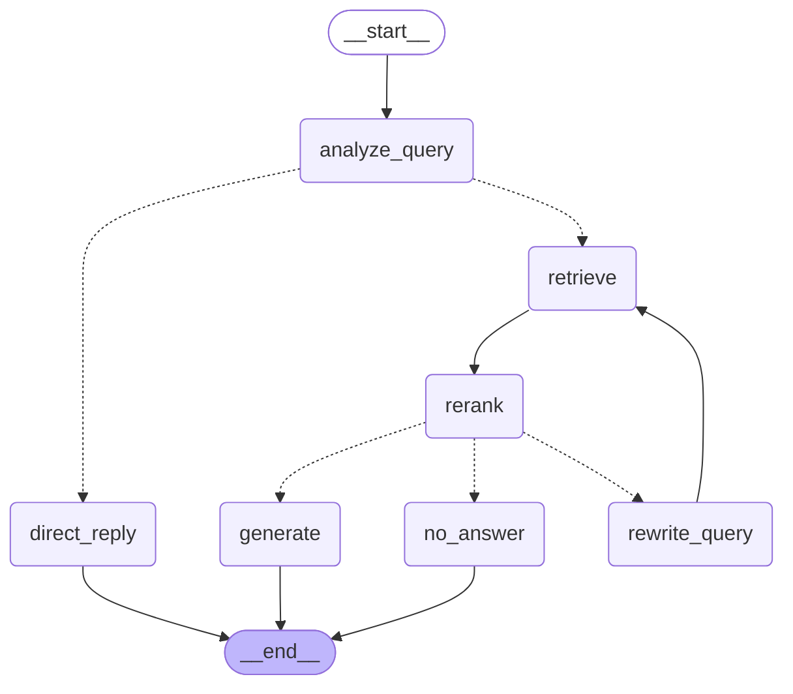

# Grafo del flujo RAG

Generado desde el código con `scripts/exploration/draw_graph.py`.

```mermaid
graph TD;
        __start__([<p>__start__</p>]):::first
        analyze_query(analyze_query)
        retrieve(retrieve)
        rerank(rerank)
        rewrite_query(rewrite_query)
        generate(generate)
        no_answer(no_answer)
        direct_reply(direct_reply)
        __end__([<p>__end__</p>]):::last
        __start__ --> analyze_query;
        analyze_query -.-> direct_reply;
        analyze_query -.-> retrieve;
        rerank -.-> generate;
        rerank -.-> no_answer;
        rerank -.-> rewrite_query;
        retrieve --> rerank;
        rewrite_query --> retrieve;
        direct_reply --> __end__;
        generate --> __end__;
        no_answer --> __end__;
        classDef default fill:#f2f0ff,line-height:1.2
        classDef first fill-opacity:0
        classDef last fill:#bfb6fc
```